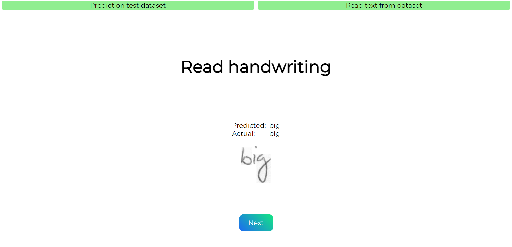
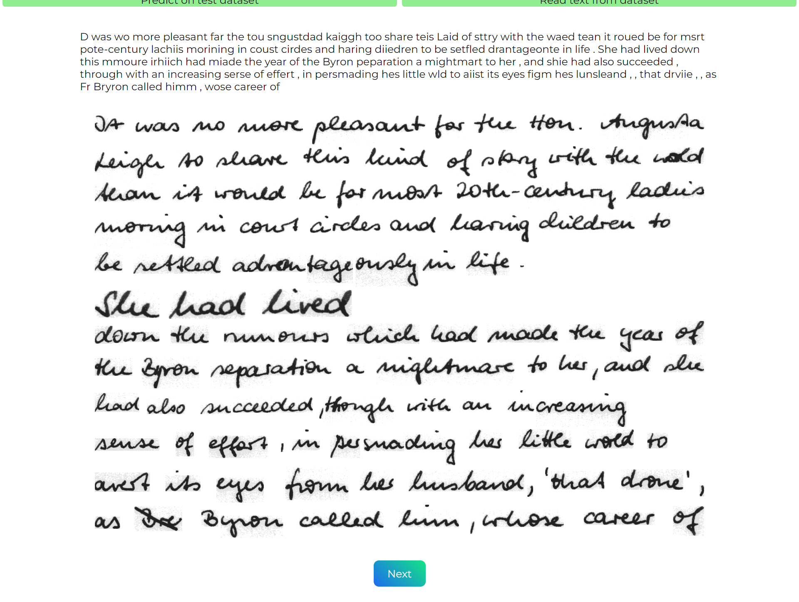

# Handwriting-Recognition

<h2>Requirements</h2>
1. Python v3.7.
2. Node.js v18.16.0.
3. npm package manager v8.6.0.
4. Angular CLI: v16.0.1.
5. OS: win32 x64

<h2>Steps to get started</h2>
1. Clone repository.	
2. Install datasets:	
    - [Dataset with words](https://www.kaggle.com/datasets/nibinv23/iam-handwriting-word-database)
    - [Dataset with sentences and forms](https://www.kaggle.com/datasets/debadityashome/iamsentences)	
3. Place downloaded datasets in 'dataset' directory. It should looks like: 
4. Run backend of app. In the root of cloned project open terminal and run following commands:	 
    `cd backend`  
    `pip install -r requirements.txt`  
    `python app.py`
5. Run frontend app. In the root of cloned project open terminal and run following commands:
    `cd frontend`  
    `npm install`  
    `ng serve`
6. Go to http://localhost:4200/ to open app.

<h2>Small demo</h2>
- You can predict text by handwriting from test dataset on default tab. Next button shows next word.

- You can also read full text on the second tab. Next button shows next document.

<h2>Model evaluation</h2>
Total count of correct words:  4456  
Correct count of correct words:  3029  
Percentage : 67.97576301615798% .  

Total count of correct symbols:  19048  
Correct count of correct symbols:  15423  
Percentage : 80.96913061738765% .  
